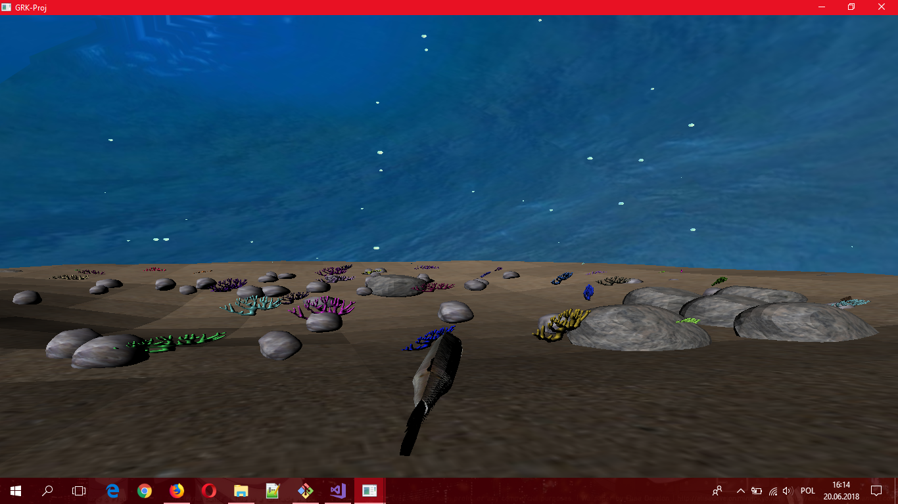
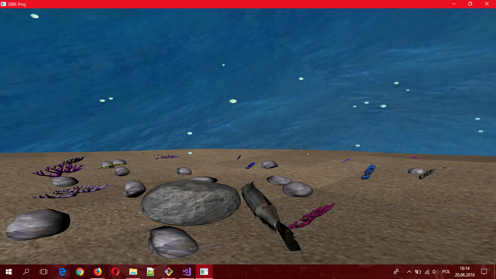

# GWP-Proj

## Wstępny opis

Scena składa się z 2 modelów kamieni, 1 modelu korala, 1 modelu ryby, 1 modelu podłoża. Do każdego obiektu stworzona została tekstsura typu diffuse. Do każdego modelu (z wyjątkiem korala) przygotowana została mapa normalnych. Ryba ma zaimplementowane animacje ogona i głowy. Scena zwiera shadery do obsługi normalnych, skyboxa, coloru, bąbelków (transparencji) oraz tekstur diffuse. W kodzie zaimplementowano także obsługę ruchu obiektów za pomocą Catmull-Roma, jednakże nie wykorzystano tego do żadnego obiektu (ze względu na brak czasu). Na rybkę działa kolizja skyboxa.

## Regiony:

**MenuItemsVariables** - zawiera enum określający aspekt obrazu (panoramiczny, full-window, swobodna kamera), albo wyjście z programu

**ControlVariables** - zawiera zmienne ruchu, aktualną pozycję kamery, kąt nachylenia

**GlobalVariables** - zawiera zmienne shaderów, pozycję kamery, macierz perspektywy

**Models** - odpowiada za tworzenie zmiennych modeli oraz ich tekstur, zawiera region Fish

**Fish** - zawiera model i tekstury ryby

**CoralGeneratorParameters** - zmienne zawierające parametry generowania korali w losowych miejscach na mapie 

**StoneGeneratorParameters** - j.w., ale dla kamieni

**BubbleGeneratorParameters** - j.w., ale losuje również seedy dla trasy ruchu bąbelków 

**Hierarchical Transformation** - klasa obsługująca hierarchię macierzy informacji. Zawiera funkcję GetFinalTransform(), która wczytuje  drzewo transformacji (przemnażana jest macierz transformacji rodziców, aż do osiagnięcia korzenia). 

**Constructors** - należą do klasy Hierarchical Transformation
**Setters and Getters** - j.w.
**Methods and functions** - j.w.

**CollisionFunctions** - zbiór funkcji przeliczających kolizje ryby z obiektami (np.: skyboxem)

**AdditionalFunctions** - dodatkowe funkcje, umożliwiające działanie projektu, takie jak: ApplyWaveFunction(), UseCatmullRom(), CreateCameraMatrix() oraz zestaw setterów dla generatorów parametrów

**DrawFunctions** - funckej rysujące, korzystające z różnej kombinacji shaderów

**Drawing complex shapes** - funkcje rysujące zaawansowane kształty (ryba, korale, kamienie skybox) oraz funkcje inicjalizujące działanie programu

**ProgramFlow** - funkcja wyświetlania Display(), funkcja inizcjalizująca Init() oraz funkcja zamykająca Shutdown()

**ReshapeFunctions** - funkcje odpowiadające za zmienianie rozmiaru ekranu (aspect ratio)

**KeyFunctions** - funkcje odpowiadające za obsługę wejścia z klawiatury

**MenuFunctions** - funkcje menu (odpowiadające za zmianę rozmiaru ekranu)

## Autorzy

Sławomir Malczewski - 407265
Damian Kaczmarczyk - 430684
